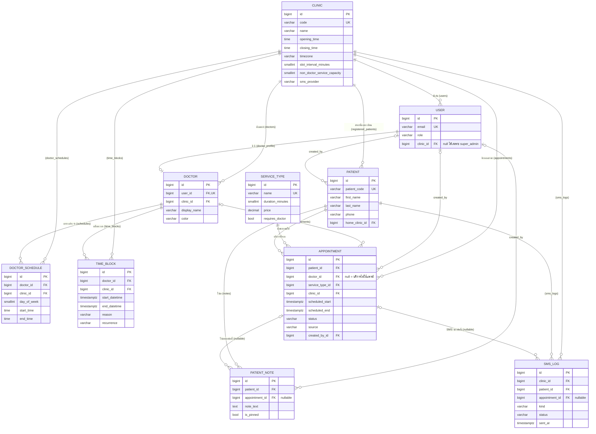

# 14 — Database Schema — ตารางทั้งหมดและความสัมพันธ์ / Tables & relationships

**TH:** เอกสารนี้อธิบายฐานข้อมูลของระบบจองคิว ได้แก่ มีตารางอะไรบ้าง แต่ละตารางเก็บอะไร สำคัญอย่างไร
และเชื่อมโยงกันแบบไหน รวมถึงเหตุผลของ `on_delete`, index และ constraint แต่ละตัว

**EN:** Every table, what it stores, why it matters, and how it links to the others, including the
reasoning behind each `on_delete` rule, index and constraint.

> ฐานข้อมูลหลัก: **PostgreSQL 16** — datetime ทุกค่าเก็บเป็น **UTC** แล้วแปลงเป็น Asia/Bangkok ตอนแสดงผล
> เรื่อง transaction/ล็อก ดูต่อที่ [13-acid-and-transactions.md](13-acid-and-transactions.md)

---

## 1. ภาพรวม / Overview

ระบบมี **10 ตารางของโดเมน** แบ่งตาม Django app:

| กลุ่ม | ตาราง | บทบาท |
|---|---|---|
| 🏢 องค์กร | `clinics_clinic` | สาขา — **ศูนย์กลางของ multi-branch** แทบทุกตารางชี้มาที่นี่ |
| 👤 ผู้ใช้ | `accounts_user` | บัญชีเจ้าหน้าที่ทุก role (ไม่มีบัญชีลูกค้า) |
| 🩺 แพทย์ | `doctors_doctor` | โปรไฟล์แพทย์ (1:1 กับ user) |
| | `doctors_doctorschedule` | ตารางออกตรวจประจำสัปดาห์ |
| | `doctors_timeblock` | บล็อกเวลาที่ไม่รับคิว (พักเที่ยง, ลา, ประชุม) |
| 💉 บริการ | `services_servicetype` | แคตตาล็อกบริการ + ระยะเวลา (ใช้ร่วมทุกสาขา) |
| 📅 คิว | `scheduling_appointment` | ★ **ตารางหัวใจของระบบ** — การนัดหมาย/คิว |
| 🧑‍🤝‍🧑 คนไข้ | `patients_patient` | ข้อมูลคนไข้ (ใช้ข้ามสาขาได้) |
| | `patients_patientnote` | โน้ตสะสมของคนไข้ |
| 📱 แจ้งเตือน | `notifications_smslog` | log การส่ง SMS ทุกข้อความ |

นอกจากนี้ยังมีตารางของ framework (ดู [หัวข้อ 8](#8-ตารางของ-framework--framework-tables))

---

## 2. แผนภาพความสัมพันธ์ / ER diagram



### อ่านแผนภาพแบบย่อ / The shape in one paragraph

**TH:** `Clinic` อยู่บนสุด ทุกอย่างสังกัดสาขา → `Doctor` มีตารางประจำ (`DoctorSchedule`) และช่วงงดรับ (`TimeBlock`)
→ `Appointment` คือจุดที่ทุกเส้นมาบรรจบ: **ใคร** (`Patient`) มาทำ **อะไร** (`ServiceType`) กับ **ใคร** (`Doctor`)
**ที่ไหน** (`Clinic`) **เมื่อไร** (`scheduled_start/end`) และ **ใครบันทึก** (`created_by`)
→ จากนัดหนึ่งนัดจะแตกออกไปเป็นโน้ต (`PatientNote`) และ SMS แจ้งเตือน (`SMSLog`)

---

## 3. รายละเอียดแต่ละตาราง / Table reference

> คอลัมน์ `created_at` (มี index) และ `updated_at` มีในทุกตารางยกเว้น `accounts_user` (มาจาก `TimeStampedModel`)
> ตารางที่มี `created_by` ด้วยสืบทอดจาก `AuditableModel` — ดู [apps/common/models.py](../backend/apps/common/models.py)

### 3.1 `clinics_clinic` — สาขา 🏢

**ความสำคัญ:** เป็น "หน่วยแบ่งข้อมูล" ของระบบ multi-branch — permission ของ Admin/Staff/Doctor
filter ทุก query ด้วย `clinic` ของผู้ใช้เสมอ

| คอลัมน์ | ชนิด | หมายเหตุ |
|---|---|---|
| `id` | bigint PK | |
| `code` | varchar(20) **UNIQUE** | รหัสสาขา เช่น `BKK` — ใช้เป็น prefix ของรหัสคนไข้ (`BKK-000123`) |
| `name`, `address`, `phone` | | |
| `opening_time`, `closing_time` | time | กรอบเวลาทำการ — slot ต้องอยู่ในกรอบนี้ |
| `timezone` | varchar(64) | default `Asia/Bangkok` |
| `slot_interval_minutes` | smallint | ระยะห่างของเวลาเริ่ม slot (default 15 นาที) |
| `non_doctor_service_capacity` | smallint | จำนวนเคสพร้อมกันสูงสุดของบริการที่ไม่ใช้แพทย์ (default 1) |
| `sms_provider`, `sms_sender_name` | varchar | ตั้ง SMS gateway แยกต่อสาขาได้ |
| `is_active` | bool | ปิดสาขาแบบ soft (ไม่ลบข้อมูล) |

**Constraint:** `clinic_closing_time_after_opening_time` — `closing_time > opening_time`

### 3.2 `accounts_user` — บัญชีเจ้าหน้าที่ 👤

**ความสำคัญ:** ใช้ login (JWT) และกำหนดสิทธิ์ผ่าน `role` + `clinic`

| คอลัมน์ | ชนิด | หมายเหตุ |
|---|---|---|
| `email` | varchar(254) **UNIQUE** | ใช้เป็น username |
| `password` | varchar(128) | **hash** โดย Django — ไม่เก็บ plain text |
| `role` | varchar(20), index | `super_admin` / `admin` / `staff` / `doctor` |
| `clinic_id` | FK → clinic, **nullable** | null ได้เฉพาะ `super_admin` (มองข้ามสาขา) |
| `full_name`, `phone` | | |
| `is_active`, `is_staff`, `is_superuser`, `last_login`, `date_joined` | | ฟิลด์มาตรฐานของ Django auth |

**Constraint:** `user_non_super_admin_requires_clinic` — `role = 'super_admin' OR clinic_id IS NOT NULL`
→ ฐานข้อมูลรับประกันว่าไม่มีพนักงาน "ลอย" ที่ไม่สังกัดสาขา (ถ้ามีจะหลุด branch scoping)

### 3.3 `doctors_doctor` — โปรไฟล์แพทย์ 🩺

| คอลัมน์ | ชนิด | หมายเหตุ |
|---|---|---|
| `user_id` | FK → user, **UNIQUE (1:1)** | แพทย์หนึ่งคน = บัญชีเดียว |
| `clinic_id` | FK → clinic | ต้องตรงกับ `user.clinic` (ตรวจใน `clean()`) |
| `display_name` | varchar(150) | ชื่อที่แสดง เช่น "พญ. สมหญิง" |
| `specialties` | varchar(255) | |
| `color` | varchar(7) | สี hex สำหรับปฏิทิน |
| `is_active` | bool | |

**Index:** `(clinic_id, is_active)` — หน้าจอดึง "แพทย์ที่ยัง active ของสาขานี้" บ่อยที่สุด

### 3.4 `doctors_doctorschedule` — ตารางออกตรวจประจำสัปดาห์

**ความสำคัญ:** เป็น **แหล่งที่มาของเวลาว่าง** — slot จองได้ต้องอยู่ในช่วงเหล่านี้เท่านั้น

| คอลัมน์ | ชนิด | หมายเหตุ |
|---|---|---|
| `doctor_id` | FK → doctor | |
| `clinic_id` | FK → clinic | คัดลอกจาก `doctor.clinic` อัตโนมัติตอน save (denormalized) |
| `day_of_week` | smallint 0–6 | 0 = จันทร์ |
| `start_time`, `end_time` | time | หนึ่งแถว = หนึ่งช่วง (วันเดียวมีหลายช่วงได้ เช่น เช้า/บ่าย) |
| `is_active` | bool | |

**Constraints:** `doctor_schedule_end_after_start`, `doctor_schedule_unique_start_per_day` (`doctor, day_of_week, start_time` ห้ามซ้ำ)
**Index:** `(doctor_id, day_of_week, is_active)` — ใช้ตอนคำนวณ slot ของ "แพทย์คนนี้ วันนี้"

### 3.5 `doctors_timeblock` — บล็อกเวลาพิเศษ

**ความสำคัญ:** **หักออก** จากเวลาว่างในตาราง (พักเที่ยง, ลา, เคสด่วน)

| คอลัมน์ | ชนิด | หมายเหตุ |
|---|---|---|
| `doctor_id`, `clinic_id` | FK | `clinic` คัดลอกจากแพทย์เหมือนตารางประจำ |
| `start_datetime`, `end_datetime` | timestamptz | `start_datetime` มี index |
| `reason` | varchar | `lunch` / `meeting` / `urgent_case` / `leave` / `other` |
| `note` | varchar(255) | |
| `is_recurring`, `recurrence`, `recurrence_end_date` | | รองรับ `daily` / `weekly` (เช่น พักเที่ยงทุกวัน) |

**Constraint:** `time_block_end_after_start` · **Index:** `(doctor_id, start_datetime)`

### 3.6 `services_servicetype` — ประเภทบริการ 💉

**ความสำคัญ:** `duration_minutes` เป็นตัวกำหนดความยาวคิว — `scheduled_end` คำนวณจากค่านี้เสมอ
เป็น **แคตตาล็อกกลาง** (ไม่มี `clinic_id`) เพื่อให้รายงานข้ามสาขาเทียบบริการเดียวกันได้

| คอลัมน์ | ชนิด | หมายเหตุ |
|---|---|---|
| `name` | varchar(150) **UNIQUE** | |
| `category` | varchar(80), index | |
| `description` | text | |
| `duration_minutes` | smallint | |
| `price` | decimal | |
| `requires_doctor` | bool | `false` → คิวไม่มีแพทย์ ใช้เพดาน `clinic.non_doctor_service_capacity` แทน |
| `is_active` | bool | |

### 3.7 `scheduling_appointment` — การนัดหมาย/คิว ★📅

**ความสำคัญ:** ตารางหัวใจ ทุกฟีเจอร์ (หน้าคิว, ปฏิทิน, ประวัติคนไข้, รายงาน, SMS) อ่านจากที่นี่

| คอลัมน์ | ชนิด | หมายเหตุ |
|---|---|---|
| `patient_id` | FK → patient | |
| `doctor_id` | FK → doctor, **nullable** | null = บริการที่ไม่ใช้แพทย์ |
| `service_type_id` | FK → service_type | |
| `clinic_id` | FK → clinic | สาขาที่มารับบริการ (อาจต่างจาก `patient.home_clinic`) |
| `scheduled_start`, `scheduled_end` | timestamptz | `end = start + service.duration_minutes` |
| `status` | varchar, index | `booked` → `confirmed` → `checked_in` → `in_progress` → `completed` / `cancelled` / `no_show` |
| `source` | varchar | `staff_created` / `walk_in` (ไม่มี `online`) |
| `note` | varchar(255) | โน้ตสั้นของนัดนี้ |
| `checked_in_at`, `started_at`, `completed_at` | timestamptz null | เวลาจริงของแต่ละขั้น — ใช้คำนวณเวลารอในรายงาน |
| `cancelled_reason` | varchar(255) | |
| `created_by_id` | FK → user, nullable | audit trail |

**Constraints:**
- `appointment_end_after_start` — `scheduled_end > scheduled_start`
- **`appointment_no_overlap_per_doctor`** (exclusion, PostgreSQL) — แพทย์คนเดียวกันห้ามมีคิวที่ยังกินเวลาซ้อนกัน
  (นับเฉพาะ `booked/confirmed/checked_in/in_progress/completed`) — รายละเอียดใน [13-acid](13-acid-and-transactions.md)

**Indexes:**
| Index | ใช้กับ query |
|---|---|
| `scheduled_start` | ช่วงเวลาทั่วไป |
| `(clinic_id, scheduled_start)` | หน้าคิววันนี้ของสาขา, ปฏิทิน, รายงาน |
| `(doctor_id, scheduled_start)` | คำนวณ slot ว่างของแพทย์, ตารางของแพทย์ |
| `(status, scheduled_start)` | งาน SMS หา "นัดที่ยัง booked/confirmed ในช่วงเวลานี้" |
| GiST `(doctor_id, tstzrange)` | สร้างอัตโนมัติโดย exclusion constraint |

### 3.8 `patients_patient` — คนไข้ 🧑‍🤝‍🧑

**ความสำคัญ:** ใช้ร่วมข้ามสาขา — คนไข้คนเดียวไปหลายสาขาได้โดยไม่สร้าง record ซ้ำ (จับคู่ด้วยเบอร์โทร)

| คอลัมน์ | ชนิด | หมายเหตุ |
|---|---|---|
| `patient_code` | varchar(20) **UNIQUE** | สร้างอัตโนมัติ `<รหัสสาขา>-<ลำดับ 6 หลัก>` |
| `first_name`, `last_name` | varchar(100) | |
| `phone` | varchar(10), index | ตัวค้นหาหลัก |
| `date_of_birth` | date null | |
| `gender` | varchar | `female` / `male` / `other` / `unspecified` |
| `home_clinic_id` | FK → clinic | สาขาที่ลงทะเบียนครั้งแรก — **ไม่ได้** จำกัดว่าจองได้ที่สาขาเดียว |
| `is_active` | bool | |
| `created_by_id` | FK → user, nullable | |

**Constraint:** `patient_unique_phone_and_name` — `(phone, first_name, last_name)` ห้ามซ้ำ
(เบอร์เดียวกันมีหลายคนได้ เช่น แม่กับลูก แต่ชื่อ-สกุลเดียวกันซ้ำไม่ได้)

**Indexes:** `phone`, `(last_name, first_name)`, และ **GIN trigram** บน `first_name`, `last_name`
(migration `0003_patient_search_indexes`, ใช้ `pg_trgm`) — ให้ค้นชื่อแบบพิมพ์บางส่วนได้เร็ว

### 3.9 `patients_patientnote` — โน้ตคนไข้

| คอลัมน์ | ชนิด | หมายเหตุ |
|---|---|---|
| `patient_id` | FK → patient | |
| `appointment_id` | FK → appointment, **nullable** | ผูกกับนัดใดนัดหนึ่งได้ หรือเป็นโน้ตทั่วไปของคนไข้ |
| `note_text` | text | เช่น "แพ้ยาชา", "ขอหมอคนเดิม" |
| `is_pinned` | bool | โน้ตสำคัญแสดงบนสุด |
| `created_by_id` | FK → user, nullable | |

**Index:** `(patient_id, -created_at)` — ดึงโน้ตล่าสุดของคนไข้

### 3.10 `notifications_smslog` — log การส่ง SMS 📱

**ความสำคัญ:** ตรวจย้อนหลังได้ว่าส่งอะไร ถึงใคร สำเร็จหรือไม่ และกันส่งซ้ำ

| คอลัมน์ | ชนิด | หมายเหตุ |
|---|---|---|
| `clinic_id`, `patient_id` | FK | |
| `appointment_id` | FK, nullable | null ได้สำหรับ SMS แบบ `manual` |
| `kind` | varchar | `appointment_reminder` / `manual` |
| `message` | text | ข้อความที่ส่งจริง |
| `status` | varchar, index | `pending` → `sent` / `failed` |
| `provider`, `provider_message_id`, `error_message` | | ข้อมูลจาก gateway |
| `sent_at` | timestamptz null | |

**Constraint:** `sms_unique_reminder_per_appointment` — `(appointment_id, kind)` ห้ามซ้ำ **ยกเว้นแถวที่ `failed`**
(partial unique) → ส่ง reminder ได้ครั้งเดียวต่อนัด แต่ถ้าล้มเหลวยังส่งใหม่ได้
**Index:** `(clinic_id, -created_at)`

---

## 4. ความสัมพันธ์และกฎการลบ / Relationships & `on_delete`

| จาก → ไป | ชนิด | `on_delete` | เหตุผล |
|---|---|---|---|
| user → clinic | N:1 | **PROTECT** | ลบสาขาที่ยังมีพนักงานไม่ได้ |
| doctor → user | **1:1** | **PROTECT** | ต้องจัดการโปรไฟล์แพทย์ก่อนลบบัญชี |
| doctor → clinic | N:1 | PROTECT | |
| doctor_schedule → doctor | N:1 | **CASCADE** | ตารางประจำไม่มีความหมายถ้าไม่มีแพทย์ |
| time_block → doctor | N:1 | **CASCADE** | เหมือนกัน |
| doctor_schedule / time_block → clinic | N:1 | PROTECT | |
| appointment → patient | N:1 | **PROTECT** | ห้ามลบคนไข้ที่มีประวัตินัด (ข้อมูลรักษา/รายงาน) |
| appointment → doctor | N:1 | **PROTECT** | ห้ามลบแพทย์ที่มีคิว — ใช้ `is_active=false` แทน |
| appointment → service_type | N:1 | **PROTECT** | ห้ามลบบริการที่ถูกใช้แล้ว — รายงานย้อนหลังต้องอยู่ครบ |
| appointment → clinic | N:1 | PROTECT | |
| patient → home_clinic | N:1 | PROTECT | |
| patient_note → patient | N:1 | **CASCADE** | โน้ตเป็นของคนไข้ |
| patient_note → appointment | N:1 | **SET_NULL** | ถ้านัดหายไป โน้ตยังเก็บไว้กับคนไข้ |
| sms_log → patient / clinic | N:1 | PROTECT | log ต้องตรวจย้อนหลังได้ |
| sms_log → appointment | N:1 | **SET_NULL** | log อยู่ต่อแม้นัดถูกลบ |
| `created_by` ทุกตาราง → user | N:1 | **SET_NULL** | ลบบัญชีพนักงานได้โดยไม่ทำให้ข้อมูลที่เขาบันทึกหายไป |

**หลักที่ใช้ / Design rule:**
- **PROTECT** เป็นค่าหลัก — ข้อมูลทางการแพทย์และรายงานต้องไม่หายเพราะลบแม่ตาราง
  ในทางปฏิบัติระบบ "ลบ" ด้วยการตั้ง `is_active = false` (soft delete) แทน
- **CASCADE** ใช้เฉพาะข้อมูลที่เป็น "ส่วนหนึ่ง" ของแม่จริง ๆ (ตารางแพทย์, โน้ต)
- **SET_NULL** ใช้กับการอ้างอิงเสริม (audit, ลิงก์ไปนัด) ที่ข้อมูลลูกควรอยู่ต่อได้

---

## 5. ทำไม `clinic_id` ซ้ำหลายที่? / Why is `clinic_id` everywhere?

**TH:** `doctor_schedule` และ `time_block` หา clinic ผ่าน `doctor.clinic` ได้อยู่แล้ว แต่ยังเก็บ `clinic_id` ซ้ำ
(denormalization) โดยตั้งใจ เพราะ:

1. **Branch scoping ทำได้แบบเดียวกันทุกตาราง** — `BranchScopedQuerySetMixin` filter `clinic = user.clinic`
   ได้ตรง ๆ ไม่ต้อง join ต่อแต่ละ model
2. **ป้องกันข้อมูลรั่วข้ามสาขา** — ถ้าต้องจำว่าตารางไหนต้อง join ผ่านอะไร มีโอกาสลืมและเปิดข้อมูลข้ามสาขา
3. **Index ได้ตรง** — query ต่อสาขาใช้ index ได้โดยไม่ join

ความถูกต้องรักษาไว้ด้วย `save()` ที่ตั้ง `clinic = doctor.clinic` เสมอ และ `Doctor.clean()` ที่ตรวจว่า
`doctor.clinic == user.clinic`

**ข้อยกเว้นที่ตั้งใจ:** `services_servicetype` **ไม่มี** `clinic_id` (แคตตาล็อกกลาง) และ `patients_patient`
ใช้ `home_clinic_id` ซึ่งเป็นแค่ "สาขาที่ลงทะเบียน" ไม่ใช่ขอบเขตการมองเห็น — ค้นหา/จองข้ามสาขาได้

---

## 6. ข้อมูลไหลผ่านตารางอย่างไร / How data flows

### จองคิว 1 ครั้ง

```
1. ค้นคนไข้         patients_patient          (phone index / trigram)
                    └─ ไม่เจอ → INSERT patient (สร้าง patient_code)
2. หาเวลาว่าง       doctors_doctorschedule    (ช่วงที่ออกตรวจ)
                    − doctors_timeblock       (หักบล็อกเวลา)
                    − scheduling_appointment  (หักคิวที่จองแล้ว)
                    + services_servicetype    (ความยาว slot)
3. บันทึก           LOCK doctors_doctor → INSERT scheduling_appointment
4. แจ้งเตือน         (วันก่อนนัด) Celery → INSERT notifications_smslog → ส่ง → UPDATE status
```

### Query หลักของแต่ละหน้าจอ

| หน้าจอ / งาน | ตารางหลัก | Index ที่ใช้ |
|---|---|---|
| หน้าคิววันนี้ | appointment ⨝ patient, doctor, service_type | `(clinic_id, scheduled_start)` |
| คำนวณ slot ว่าง | doctor_schedule, time_block, appointment | `(doctor, day_of_week, is_active)`, `(doctor, start_datetime)`, `(doctor, scheduled_start)` |
| ค้นหาคนไข้ | patient | `phone`, trigram GIN |
| ประวัติคนไข้ | appointment, patient_note | FK `patient_id`, `(patient, -created_at)` |
| รายงาน / no-show rate | appointment (aggregate `Count` + `Case/When`) | `(clinic_id, scheduled_start)`, `(status, scheduled_start)` |
| งานส่ง SMS | appointment, sms_log | `(status, scheduled_start)` |

---

## 7. สรุป Constraint ทั้งหมด / All constraints

| ตาราง | Constraint | ชนิด | กฎ |
|---|---|---|---|
| clinic | `clinic_closing_time_after_opening_time` | CHECK | ปิด > เปิด |
| clinic | `code` | UNIQUE | |
| user | `user_non_super_admin_requires_clinic` | CHECK | ไม่ใช่ super admin ต้องมีสาขา |
| user | `email` | UNIQUE | |
| doctor | `user_id` | UNIQUE | 1:1 |
| doctor_schedule | `doctor_schedule_end_after_start` | CHECK | จบ > เริ่ม |
| doctor_schedule | `doctor_schedule_unique_start_per_day` | UNIQUE | (doctor, day, start) |
| time_block | `time_block_end_after_start` | CHECK | จบ > เริ่ม |
| service_type | `name` | UNIQUE | |
| appointment | `appointment_end_after_start` | CHECK | จบ > เริ่ม |
| appointment | **`appointment_no_overlap_per_doctor`** | **EXCLUDE (GiST)** | แพทย์เดียวกันห้ามมีคิวซ้อนเวลา |
| patient | `patient_code` | UNIQUE | |
| patient | `patient_unique_phone_and_name` | UNIQUE | (phone, first, last) |
| sms_log | `sms_unique_reminder_per_appointment` | UNIQUE (partial) | reminder 1 ครั้ง/นัด ยกเว้นที่ failed |

**PostgreSQL extensions ที่ใช้:** `btree_gist` (exclusion constraint), `pg_trgm` (ค้นชื่อคนไข้)
— ทั้งสองถูกข้ามบน SQLite ผ่าน `PostgresOnlySQL`

---

## 8. ตารางของ framework / Framework tables

ไม่ได้ออกแบบเอง แต่มีอยู่ในฐานข้อมูล:

| ตาราง | มาจาก | ใช้ทำอะไร |
|---|---|---|
| `accounts_user_groups`, `accounts_user_user_permissions` | `PermissionsMixin` | M2M ของ Django auth (ระบบใช้ `role` แทนเป็นหลัก) |
| `auth_group`, `auth_permission`, `auth_group_permissions` | `django.contrib.auth` | |
| `token_blacklist_outstandingtoken`, `token_blacklist_blacklistedtoken` | simplejwt | ทำให้ logout ยกเลิก refresh token ได้จริง |
| `django_migrations` | Django | บันทึกว่า migration ไหนรันแล้ว |
| `django_content_type`, `django_admin_log`, `django_session` | Django | admin / sessions |

---

## 9. แก้ schema อย่างไร / Changing the schema

1. แก้ `models.py` ของ app ที่เกี่ยวข้อง
2. `python manage.py makemigrations` → **commit ไฟล์ migration คู่กับโค้ดเสมอ**
3. ถ้าเพิ่มสถานะใหม่ใน `OCCUPYING_STATUSES` → ต้องสร้าง migration แก้ SQL ของ exclusion constraint ด้วย
4. ถ้าเพิ่มตารางที่เป็นข้อมูลของสาขา → ใส่ `clinic` FK (PROTECT) และใช้ `BranchScopedQuerySetMixin` ใน view
5. อัปเดตเอกสารนี้
