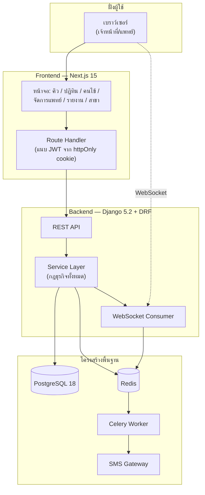
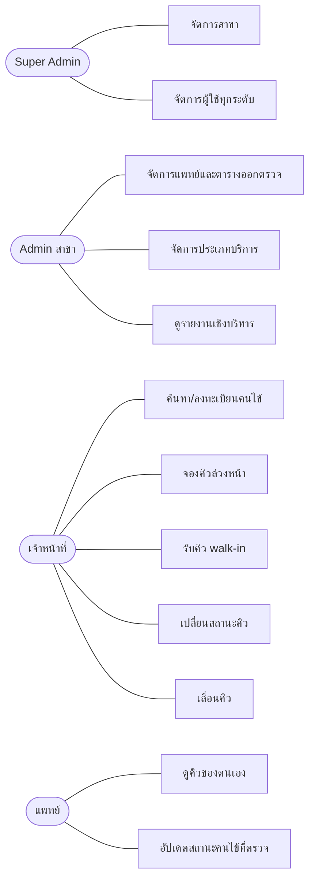
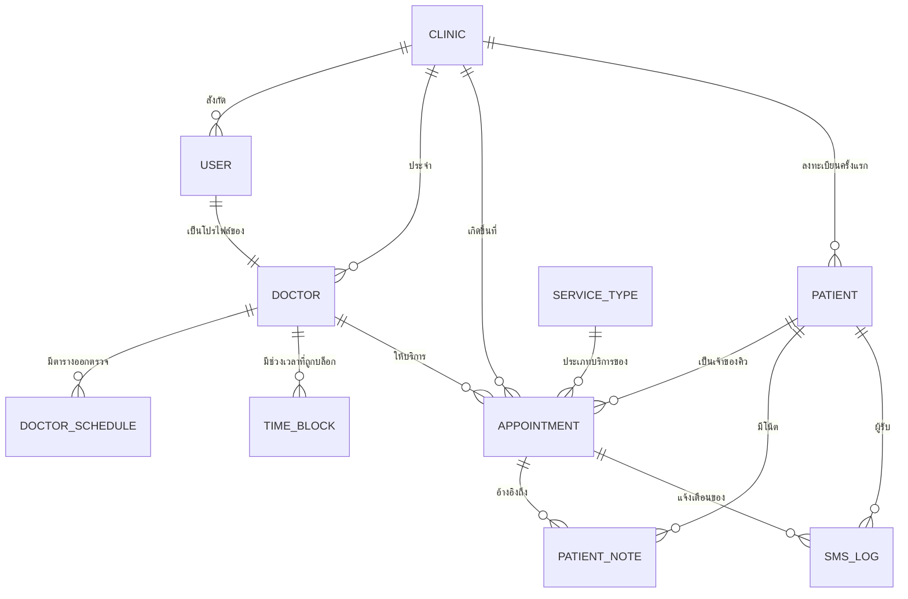
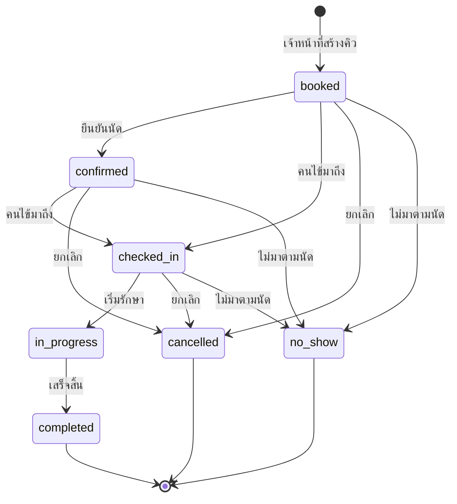
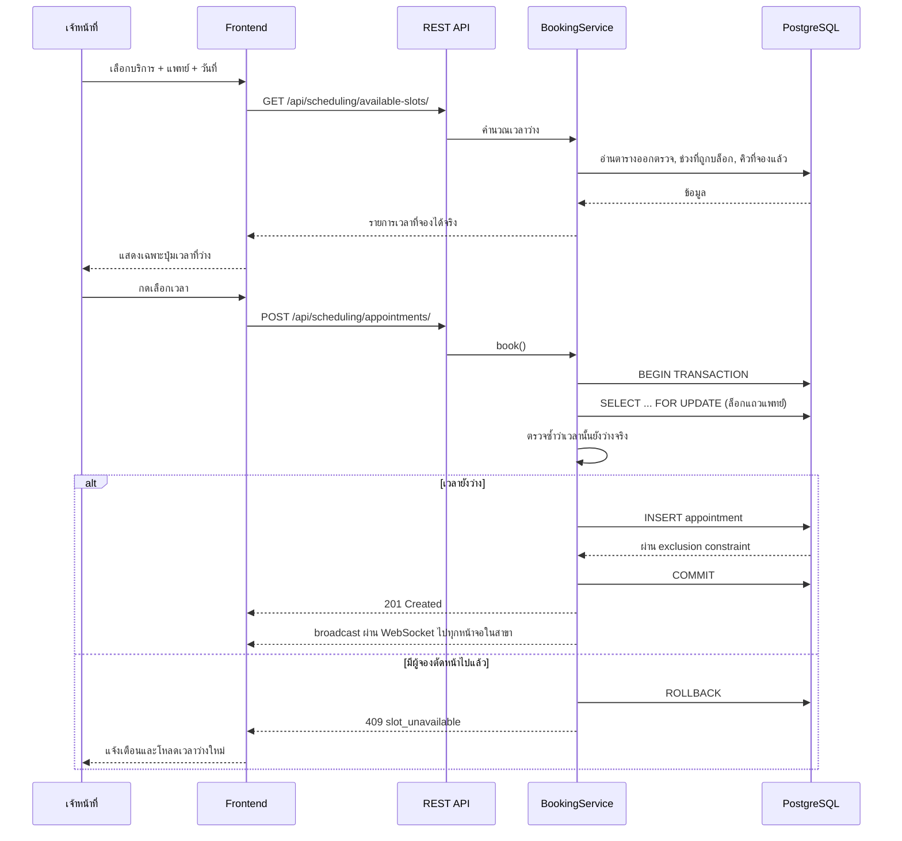

# ข้อมูลประกอบการจัดทำวิทยานิพนธ์
## ระบบจองคิวคลินิกออนไลน์ (Clinic Queue Booking System)

> **วิธีใช้เอกสารนี้**
> ข้อมูลทั้งหมดในไฟล์นี้ **ดึงมาจากระบบจริงที่พัฒนาเสร็จแล้ว** (โครงสร้างฐานข้อมูล, endpoint, ผลการทดสอบ, สถิติโค้ด)
> จึงนำไปอ้างอิงในเล่มได้โดยตรง ส่วนที่ทำเครื่องหมาย **🔲 [ผู้เขียนกรอกเอง]** คือส่วนที่ต้องเขียน/เก็บข้อมูลเพิ่ม
> เช่น ที่มาของปัญหาจากคลินิกจริง และผลประเมินความพึงพอใจของผู้ใช้
>
> ข้อมูล ณ วันที่จัดทำ: 15 สิงหาคม 2569

---

## สารบัญ

1. [ข้อมูลทั่วไปของระบบ](#1-ข้อมูลทั่วไปของระบบ)
2. [บทที่ 1 บทนำ](#บทที่-1-บทนำ)
3. [บทที่ 2 ทฤษฎีและเทคโนโลยีที่เกี่ยวข้อง](#บทที่-2-ทฤษฎีและเทคโนโลยีที่เกี่ยวข้อง)
4. [บทที่ 3 การวิเคราะห์และออกแบบระบบ](#บทที่-3-การวิเคราะห์และออกแบบระบบ)
5. [บทที่ 4 ผลการดำเนินงาน](#บทที่-4-ผลการดำเนินงาน)
6. [บทที่ 5 สรุปผลและข้อเสนอแนะ](#บทที่-5-สรุปผลและข้อเสนอแนะ)
7. [ภาคผนวก](#ภาคผนวก)

---

## 1. ข้อมูลทั่วไปของระบบ

| หัวข้อ | รายละเอียด |
|---|---|
| ชื่อระบบ (ไทย) | ระบบจองคิวคลินิกออนไลน์ |
| ชื่อระบบ (อังกฤษ) | Clinic Queue Booking System |
| ประเภทระบบ | ระบบสารสนเทศเพื่อการจัดการ (Management Information System) แบบ Web Application |
| ลักษณะเด่น | ระบบหลังบ้าน (Back-office) รองรับหลายสาขา (Multi-branch) และป้องกันการจองคิวซ้อนทับด้วยกลไก 2 ชั้น |
| กลุ่มผู้ใช้ | เจ้าหน้าที่ภายในคลินิก 4 บทบาท (ไม่มีส่วนของลูกค้า) |
| สถาปัตยกรรม | Client–Server แยก Frontend/Backend สื่อสารผ่าน REST API + WebSocket |
| ขนาดโค้ด | 12,848 บรรทัด (163 ไฟล์) |
| การทดสอบ | Unit/Integration Test 92 กรณี ผ่านทั้งหมด |

### บทบาทผู้ใช้และสิทธิ์

| บทบาท | ขอบเขตข้อมูล | สิทธิ์หลัก |
|---|---|---|
| Super Admin | ทุกสาขา | จัดการสาขา, จัดการผู้ใช้ทุกระดับ, ดูรายงานรวมทั้งเครือ |
| Admin (ผู้จัดการสาขา) | สาขาตนเอง | จัดการแพทย์/ตารางออกตรวจ/บริการ, ดูรายงานของสาขา |
| Staff (เจ้าหน้าที่หน้าเคาน์เตอร์) | สาขาตนเอง | จัดการคิว, รับ walk-in, ค้นหา/ลงทะเบียนคนไข้ |
| Doctor (แพทย์) | คิวของตนเองในสาขา | ดูตารางตนเอง, อัปเดตสถานะคนไข้ |

---

## บทที่ 1 บทนำ

### 1.1 ความเป็นมาและความสำคัญของปัญหา

🔲 **[ผู้เขียนกรอกเอง]** — ควรมีข้อมูลสนับสนุนจากคลินิกกรณีศึกษา เช่น

- ปัจจุบันคลินิกใช้วิธีใดจดคิว (สมุดบันทึก / Excel / LINE) และมีปัญหาอะไร
- สถิติปัญหาที่พบ เช่น จำนวนครั้งที่จองคิวชนกันต่อเดือน, เวลารอเฉลี่ยของคนไข้, อัตราการผิดนัด
- ปัญหาเมื่อคลินิกขยายเป็นหลายสาขา เช่น ประวัติคนไข้ไม่เชื่อมกัน ต้องกรอกข้อมูลซ้ำ

> **ประเด็นที่ระบบนี้แก้ได้จริงและใช้อ้างอิงได้:** การจองคิวซ้อนทับ (double booking), การรับ walk-in เกินความจุ,
> ข้อมูลคนไข้กระจัดกระจายระหว่างสาขา, การไม่มีข้อมูลเชิงสถิติสำหรับตัดสินใจบริหาร

### 1.2 วัตถุประสงค์ของการวิจัย

1. เพื่อวิเคราะห์และออกแบบระบบจองคิวและนัดหมายสำหรับคลินิกที่มีหลายสาขา
2. เพื่อพัฒนาระบบที่**ป้องกันการจองคิวซ้อนทับได้อย่างสมบูรณ์** ทั้งการจองล่วงหน้าและคิว walk-in
3. เพื่อพัฒนาระบบฐานข้อมูลคนไข้ที่ใช้ร่วมกันข้ามสาขาโดยไม่เกิดข้อมูลซ้ำซ้อน
4. เพื่อพัฒนาระบบรายงานเชิงบริหารสำหรับวิเคราะห์ช่วงเวลาที่มีผู้ใช้บริการหนาแน่นและอัตราการผิดนัด
5. เพื่อประเมินประสิทธิภาพและความพึงพอใจของผู้ใช้ระบบ 🔲 *[ต้องเก็บข้อมูลจริง]*

### 1.3 ขอบเขตของการวิจัย

**ขอบเขตด้านฟังก์ชัน (พัฒนาเสร็จแล้วทั้งหมด)**

| # | ฟังก์ชัน | สถานะ |
|---|---|---|
| 1 | ระบบยืนยันตัวตนด้วย JWT และกำหนดสิทธิ์ตามบทบาท 4 ระดับ | ✅ |
| 2 | จัดการสาขา (เวลาทำการ, ความละเอียดตารางคิว, ความจุ) | ✅ |
| 3 | จัดการแพทย์ ตารางออกตรวจประจำสัปดาห์ และช่วงเวลาที่ไม่รับคิว | ✅ |
| 4 | จัดการประเภทบริการและระยะเวลามาตรฐาน | ✅ |
| 5 | คำนวณช่วงเวลาว่างที่จองได้จริง (Available Slot Calculation) | ✅ |
| 6 | จองคิวล่วงหน้าพร้อมป้องกันคิวซ้อนทับ | ✅ |
| 7 | หน้าจอคิวหน้างานแบบเรียลไทม์ | ✅ |
| 8 | รับคิว walk-in โดยไม่อนุญาตให้เกินความจุ | ✅ |
| 9 | เปลี่ยนสถานะคิวตามลำดับที่กำหนด และเลื่อนคิว | ✅ |
| 10 | ฐานข้อมูลคนไข้ ค้นหาข้ามสาขา และบันทึกโน้ตสะสม | ✅ |
| 11 | รายงานสรุปยอดจอง ช่วงเวลาหนาแน่น และอัตราผิดนัด | ✅ |
| 12 | แจ้งเตือนนัดหมายล่วงหน้าผ่าน SMS | ✅ (พร้อมใช้ ต้องผูก API key ของผู้ให้บริการ) |

**ขอบเขตด้านเทคนิค**

- ระบบทำงานบนเว็บเบราว์เซอร์ ไม่มีแอปพลิเคชันมือถือ
- เก็บเวลาในฐานข้อมูลเป็น UTC และแสดงผลตามโซนเวลาของสาขา (Asia/Bangkok)
- รองรับผู้ใช้พร้อมกันในระดับคลินิกขนาดกลาง 🔲 *[ระบุตัวเลขถ้าได้ทำ load test]*

**สิ่งที่อยู่นอกขอบเขต**

- ไม่มีหน้าเว็บสาธารณะให้ลูกค้าจองคิวด้วยตนเอง (ทุกการจองสร้างโดยเจ้าหน้าที่)
- ไม่มีระบบชำระเงิน ออกใบเสร็จ หรือเชื่อมต่อระบบบัญชี
- ไม่มีเวชระเบียนอิเล็กทรอนิกส์ (EMR) เต็มรูปแบบ มีเพียงโน้ตย่อของคนไข้

### 1.4 ประโยชน์ที่คาดว่าจะได้รับ

1. ลดข้อผิดพลาดจากการจองคิวซ้อนทับให้เป็นศูนย์ ด้วยการตรวจสอบ 2 ชั้น (ระดับแอปพลิเคชันและระดับฐานข้อมูล)
2. ลดเวลาที่เจ้าหน้าที่ใช้ค้นหาเวลาว่าง เพราะระบบคำนวณและเสนอเฉพาะเวลาที่จองได้จริง
3. ลดการสร้างประวัติคนไข้ซ้ำเมื่อลูกค้าใช้บริการข้ามสาขา
4. ผู้บริหารมีข้อมูลเชิงสถิติสำหรับจัดสรรกำลังแพทย์ในช่วงเวลาที่มีผู้ใช้บริการหนาแน่น
5. ลดอัตราการผิดนัดผ่านระบบแจ้งเตือนอัตโนมัติ

### 1.5 นิยามศัพท์เฉพาะ

| ศัพท์ | ความหมายในระบบนี้ |
|---|---|
| **Slot (ช่วงเวลาที่จองได้)** | ช่วงเวลาที่แพทย์ว่างจริง คำนวณจาก ตารางออกตรวจ − ช่วงเวลาที่ถูกบล็อก − คิวที่จองแล้ว โดยมีความยาวเท่ากับระยะเวลาของบริการที่เลือก |
| **Overbooking** | การรับคิวเกินความสามารถที่ให้บริการได้จริง ระบบนี้กำหนดนโยบายไม่อนุญาตโดยเด็ดขาด |
| **Walk-in** | คนไข้ที่เดินเข้ามารับบริการโดยไม่ได้นัดล่วงหน้า |
| **Multi-branch (หลายสาขา)** | คลินิกที่มีหลายสาขา โดยข้อมูลปฏิบัติการแยกตามสาขา แต่ข้อมูลคนไข้ใช้ร่วมกัน |
| **Branch Scoping** | กลไกจำกัดให้ผู้ใช้เห็นเฉพาะข้อมูลสาขาที่ตนสังกัด |
| **Exclusion Constraint** | ข้อจำกัดระดับฐานข้อมูลของ PostgreSQL ที่ปฏิเสธการบันทึกแถวที่มีช่วงเวลาซ้อนทับกัน |
| **Half-open Interval** | การนิยามช่วงเวลาแบบ `[start, end)` คือรวมเวลาเริ่มแต่ไม่รวมเวลาสิ้นสุด ทำให้คิวที่จบ 10:30 กับคิวที่เริ่ม 10:30 ไม่ถือว่าชนกัน |

---

## บทที่ 2 ทฤษฎีและเทคโนโลยีที่เกี่ยวข้อง

### 2.1 เทคโนโลยีที่ใช้พัฒนา (เวอร์ชันจริงที่ใช้)

| ส่วน | เทคโนโลยี | เวอร์ชัน | เหตุผลที่เลือก |
|---|---|---|---|
| ภาษาฝั่งเซิร์ฟเวอร์ | Python | 3.13 | ไลบรารีครบ พัฒนาเร็ว อ่านง่าย |
| เว็บเฟรมเวิร์ก | Django | 5.2.17 | มี ORM, ระบบ migration, ระบบสิทธิ์ และ admin ในตัว |
| REST API | Django REST Framework | 3.18.0 | สร้าง API ตามมาตรฐาน REST พร้อมระบบ serializer/permission |
| ยืนยันตัวตน | djangorestframework-simplejwt | 5.5.1 | มาตรฐาน JWT พร้อมกลไก refresh/blacklist |
| ฐานข้อมูล | PostgreSQL | 18 | รองรับ exclusion constraint และ trigram index ที่ระบบนี้จำเป็นต้องใช้ |
| ตัวเชื่อมฐานข้อมูล | psycopg | 3.3.4 | ไดรเวอร์ PostgreSQL รุ่นใหม่ |
| การสื่อสารเรียลไทม์ | Django Channels + Daphne | 4.3.2 / 4.2.3 | รองรับ WebSocket บนสถาปัตยกรรม ASGI |
| งานเบื้องหลัง | Celery | 5.6.3 | จัดคิวงานส่ง SMS แบบไม่บล็อกการทำงานหลัก |
| ตัวกลางคิวงาน | Redis | 6.4.0 (client) | ทำหน้าที่เป็น broker และ channel layer |
| เอกสาร API | drf-spectacular | 0.30.0 | สร้างเอกสาร OpenAPI 3 อัตโนมัติจากโค้ด |
| เฟรมเวิร์กฝั่งผู้ใช้ | Next.js (App Router) | 15.5 | รองรับทั้ง Server/Client Component และ route handler |
| ภาษาฝั่งผู้ใช้ | TypeScript | 5.7 | ตรวจชนิดข้อมูลตั้งแต่ตอนเขียน ลดข้อผิดพลาด |
| ไลบรารีจัดรูปแบบ | TailwindCSS | 4.1 | พัฒนา UI ได้เร็วและสม่ำเสมอ |

### 2.2 ทฤษฎีที่เกี่ยวข้องกับหัวใจของระบบ

#### 2.2.1 ทฤษฎีช่วงเวลาและการซ้อนทับ (Interval Overlap)

กำหนดให้ช่วงเวลาเป็นแบบ half-open `[s, e)` ช่วงเวลา A และ B ซ้อนทับกัน ก็ต่อเมื่อ

```
A.start < B.end  ∧  B.start < A.end
```

การนิยามแบบนี้ทำให้คิวที่ต่อเนื่องกันพอดี (จบ 10:30 / เริ่ม 10:30) ไม่ถือว่าซ้อนทับ ซึ่งตรงกับการทำงานจริงของคลินิก

การหาเวลาว่างใช้การดำเนินการลบเซตของช่วงเวลา (Interval Subtraction) โดยการลบช่วง B ออกจากช่วง A ให้ผลลัพธ์ได้ 3 กรณี

| กรณี | เงื่อนไข | ผลลัพธ์ |
|---|---|---|
| ไม่ซ้อนทับ | ไม่เข้าเงื่อนไขข้างต้น | คงเหลือ A ทั้งช่วง (1 ช่วง) |
| ซ้อนบางส่วน | ตัดหัวหรือตัดท้าย | เหลือ 1 ช่วง |
| ถูกเจาะกลาง | `A.start < B.start ∧ B.end < A.end` | เหลือ 2 ช่วง (เช่น เวลาทำงานถูกพักเที่ยงคั่น) |
| ถูกครอบทั้งหมด | `B.start ≤ A.start ∧ A.end ≤ B.end` | ไม่เหลือช่วงว่าง (0 ช่วง) |

#### 2.2.2 ปัญหาภาวะแข่งขัน (Race Condition) และการควบคุมภาวะพร้อมกัน (Concurrency Control)

หากเจ้าหน้าที่ 2 คนกดจองเวลาเดียวกันพร้อมกัน การตรวจสอบแบบอ่านแล้วเขียน (check-then-act) อาจอนุญาตให้ทั้งคู่ผ่าน
ระบบนี้แก้ด้วยกลไก 2 ชั้น

1. **Pessimistic Locking** — ล็อกแถวของทรัพยากร (แพทย์) ด้วยคำสั่ง `SELECT ... FOR UPDATE` ภายในทรานแซกชัน ทำให้การจองแพทย์คนเดียวกันถูกบังคับให้ทำทีละรายการ
2. **Database Constraint** — exclusion constraint ของ PostgreSQL ทำหน้าที่เป็นด่านสุดท้าย แม้มีโปรแกรมอื่นเขียนข้อมูลโดยข้ามชั้นตรรกะ ฐานข้อมูลก็จะปฏิเสธ

#### 2.2.3 การยืนยันตัวตนด้วย JSON Web Token (JWT)

ระบบใช้โทเคน 2 ชนิด: Access Token (อายุ 15 นาที) สำหรับเรียก API และ Refresh Token (อายุ 7 วัน) สำหรับขอโทเคนใหม่
โทเคนถูกเก็บใน **httpOnly cookie** ซึ่ง JavaScript ในหน้าเว็บอ่านไม่ได้ จึงลดความเสี่ยงจากการโจมตีแบบ XSS

### 2.3 งานวิจัย/ระบบที่เกี่ยวข้อง

🔲 **[ผู้เขียนกรอกเอง]** — ควรทบทวนอย่างน้อย 3–5 ระบบ เช่น ระบบนัดหมายโรงพยาบาลของรัฐ, SaaS ต่างประเทศอย่าง Calendly หรือ Cliniko
โดยเปรียบเทียบในประเด็น: การรองรับหลายสาขา, วิธีป้องกันคิวซ้อน, การรองรับ walk-in

---

## บทที่ 3 การวิเคราะห์และออกแบบระบบ

### 3.1 สถาปัตยกรรมระบบ



**หลักการออกแบบสำคัญ:** เบราว์เซอร์ไม่เคยเรียก Django โดยตรง ทุกคำขอผ่าน Route Handler ของ Next.js
ซึ่งเป็นผู้เก็บและต่ออายุโทเคนให้ ทำให้โทเคนไม่เคยปรากฏในโค้ด JavaScript ฝั่งเบราว์เซอร์

### 3.2 แผนภาพ Use Case



> Super Admin มีสิทธิ์ของ Admin ทุกประการ และ Admin มีสิทธิ์ของเจ้าหน้าที่ทุกประการ (ความสัมพันธ์แบบสืบทอด)

### 3.3 แผนภาพความสัมพันธ์ของข้อมูล (ER Diagram)



**จำนวนตารางหลัก 10 ตาราง** (ไม่รวมตารางระบบของ Django อีก 11 ตาราง รวมทั้งสิ้น 21 ตาราง)

### 3.4 พจนานุกรมข้อมูล (Data Dictionary)

> ข้อมูลชุดนี้ดึงจากโครงสร้างฐานข้อมูลจริงด้วยการ introspect Django models

#### 3.4.1 ตาราง `accounts_user` (ผู้ใช้งาน)

| ฟิลด์ | ชนิดข้อมูล | คำอธิบาย | ข้อกำหนด |
|---|---|---|---|
| id | BigAutoField | รหัสผู้ใช้ | PK |
| email | EmailField(254) | อีเมล (ใช้เป็นชื่อผู้ใช้) | UNIQUE, INDEX |
| password | CharField(128) | รหัสผ่านที่ผ่านการเข้ารหัสแบบ hash | ไม่เก็บรหัสจริง |
| full_name | CharField(150) | ชื่อ-สกุล | |
| phone | CharField(10) | เบอร์โทร | รูปแบบ 0XXXXXXXX(X) |
| role | CharField(20) | บทบาท (super_admin/admin/staff/doctor) | INDEX |
| clinic_id | FK → clinics_clinic | สาขาที่สังกัด | NULL ได้เฉพาะ super_admin |
| is_active | BooleanField | สถานะเปิดใช้งาน | |
| is_staff | BooleanField | สิทธิ์เข้าหน้า Django admin | |
| date_joined | DateTimeField | วันที่เข้าร่วม | |

**ข้อจำกัดระดับตาราง:** `user_non_super_admin_requires_clinic` — ผู้ใช้ที่ไม่ใช่ super_admin ต้องระบุสาขาเสมอ

#### 3.4.2 ตาราง `clinics_clinic` (สาขา)

| ฟิลด์ | ชนิดข้อมูล | คำอธิบาย | ข้อกำหนด |
|---|---|---|---|
| id | BigAutoField | รหัสสาขา | PK |
| name | CharField(150) | ชื่อสาขา | |
| code | CharField(20) | รหัสสาขา ใช้เป็นคำนำหน้ารหัสคนไข้ | UNIQUE |
| address | TextField | ที่อยู่ | |
| phone | CharField(20) | เบอร์โทรสาขา | |
| opening_time | TimeField | เวลาเปิดทำการ | |
| closing_time | TimeField | เวลาปิดทำการ | ต้องหลัง opening_time |
| timezone | CharField(64) | โซนเวลา | ค่าเริ่มต้น Asia/Bangkok |
| slot_interval_minutes | PositiveSmallInteger | ความละเอียดของตารางคิว (นาที) | 5–120 |
| non_doctor_service_capacity | PositiveSmallInteger | ความจุคิวของบริการที่ไม่ใช้แพทย์ | 1–50 |
| sms_provider | CharField(20) | ผู้ให้บริการ SMS ของสาขา | |
| is_active | BooleanField | สถานะเปิดใช้งาน | |

**ข้อจำกัดระดับตาราง:** `clinic_closing_time_after_opening_time`

#### 3.4.3 ตาราง `doctors_doctor` (แพทย์)

| ฟิลด์ | ชนิดข้อมูล | คำอธิบาย | ข้อกำหนด |
|---|---|---|---|
| id | BigAutoField | รหัสแพทย์ | PK |
| user_id | OneToOne → accounts_user | บัญชีผู้ใช้ | UNIQUE |
| clinic_id | FK → clinics_clinic | สาขา | ต้องตรงกับสาขาของบัญชีผู้ใช้ |
| display_name | CharField(150) | ชื่อที่แสดงบนปฏิทิน | |
| specialties | CharField(255) | ความเชี่ยวชาญ | |
| color | CharField(7) | สีประจำตัวในปฏิทิน | รูปแบบ hex |
| is_active | BooleanField | สถานะออกตรวจ | |

#### 3.4.4 ตาราง `doctors_doctorschedule` (ตารางออกตรวจประจำสัปดาห์)

| ฟิลด์ | ชนิดข้อมูล | คำอธิบาย | ข้อกำหนด |
|---|---|---|---|
| id | BigAutoField | รหัสตาราง | PK |
| doctor_id | FK → doctors_doctor | แพทย์ | INDEX |
| clinic_id | FK → clinics_clinic | สาขา | เติมอัตโนมัติตามแพทย์ |
| day_of_week | PositiveSmallInteger | วันในสัปดาห์ (0=จันทร์ … 6=อาทิตย์) | |
| start_time | TimeField | เวลาเริ่มออกตรวจ | |
| end_time | TimeField | เวลาเลิกออกตรวจ | ต้องหลัง start_time |
| is_active | BooleanField | สถานะใช้งาน | |

**ข้อจำกัด:** `doctor_schedule_end_after_start`, `doctor_schedule_unique_start_per_day` และกฎระดับแอปพลิเคชันที่ห้ามช่วงเวลาทับกันในวันเดียวกัน

#### 3.4.5 ตาราง `doctors_timeblock` (ช่วงเวลาที่ไม่รับคิว)

| ฟิลด์ | ชนิดข้อมูล | คำอธิบาย | ข้อกำหนด |
|---|---|---|---|
| id | BigAutoField | รหัส | PK |
| doctor_id | FK → doctors_doctor | แพทย์ | INDEX |
| start_datetime | DateTimeField | เวลาเริ่มบล็อก | INDEX |
| end_datetime | DateTimeField | เวลาสิ้นสุด | ต้องหลังเวลาเริ่ม |
| reason | CharField(20) | เหตุผล (lunch/meeting/urgent_case/leave/other) | |
| note | CharField(255) | บันทึกเพิ่มเติม | |
| is_recurring | BooleanField | ซ้ำตามรอบหรือไม่ | |
| recurrence | CharField(10) | รูปแบบการซ้ำ (none/daily/weekly) | |
| recurrence_end_date | DateField | ซ้ำถึงวันที่ | NULL = ไม่จำกัด |

#### 3.4.6 ตาราง `services_servicetype` (ประเภทบริการ)

| ฟิลด์ | ชนิดข้อมูล | คำอธิบาย | ข้อกำหนด |
|---|---|---|---|
| id | BigAutoField | รหัสบริการ | PK |
| name | CharField(150) | ชื่อบริการ | UNIQUE |
| category | CharField(80) | หมวดหมู่ | INDEX |
| description | TextField | รายละเอียด | |
| duration_minutes | PositiveSmallInteger | ระยะเวลาที่ใช้ (นาที) | 5–600 |
| price | Decimal(10,2) | ราคา (บาท) | ≥ 0 |
| requires_doctor | BooleanField | ต้องมีแพทย์หรือไม่ | |
| is_active | BooleanField | เปิดให้จองหรือไม่ | |

#### 3.4.7 ตาราง `scheduling_appointment` (การนัดหมาย/คิว) — ตารางหลักของระบบ

| ฟิลด์ | ชนิดข้อมูล | คำอธิบาย | ข้อกำหนด |
|---|---|---|---|
| id | BigAutoField | รหัสคิว | PK |
| patient_id | FK → patients_patient | คนไข้ | INDEX |
| doctor_id | FK → doctors_doctor | แพทย์ | NULL ได้เฉพาะบริการที่ไม่ใช้แพทย์ |
| service_type_id | FK → services_servicetype | ประเภทบริการ | INDEX |
| clinic_id | FK → clinics_clinic | สาขา | INDEX |
| scheduled_start | DateTimeField | เวลานัดเริ่ม | INDEX |
| scheduled_end | DateTimeField | เวลานัดสิ้นสุด | คำนวณจากระยะเวลาบริการ |
| status | CharField(15) | สถานะคิว (7 สถานะ) | INDEX |
| source | CharField(15) | ที่มา (staff_created/walk_in) | |
| note | CharField(255) | โน้ตสั้น | |
| checked_in_at | DateTimeField | เวลาเช็คอินจริง | NULL |
| started_at | DateTimeField | เวลาเริ่มรักษาจริง | NULL |
| completed_at | DateTimeField | เวลาเสร็จสิ้นจริง | NULL |
| cancelled_reason | CharField(255) | เหตุผลที่ยกเลิก | |
| created_by_id | FK → accounts_user | ผู้สร้างรายการ (audit trail) | NULL |
| created_at / updated_at | DateTimeField | เวลาสร้าง/แก้ไขล่าสุด | |

**ข้อจำกัดระดับฐานข้อมูล**

| ชื่อข้อจำกัด | ประเภท | หน้าที่ |
|---|---|---|
| `appointment_end_after_start` | CHECK | เวลาสิ้นสุดต้องหลังเวลาเริ่ม |
| `appointment_no_overlap_per_doctor` | EXCLUDE USING gist | ห้ามคิวของแพทย์คนเดียวกันมีช่วงเวลาซ้อนทับ |

**ดัชนี (Index):** `(clinic, scheduled_start)`, `(doctor, scheduled_start)`, `(status, scheduled_start)`

#### 3.4.8 ตาราง `patients_patient` (คนไข้)

| ฟิลด์ | ชนิดข้อมูล | คำอธิบาย | ข้อกำหนด |
|---|---|---|---|
| id | BigAutoField | รหัสระบบ | PK |
| patient_code | CharField(20) | รหัสคนไข้ที่ระบบสร้าง เช่น BKK-000001 | UNIQUE, INDEX |
| first_name / last_name | CharField(100) | ชื่อ / นามสกุล | |
| phone | CharField(10) | เบอร์โทร (ใช้จับคู่ข้อมูลเดิม) | INDEX |
| date_of_birth | DateField | วันเกิด | NULL |
| gender | CharField(15) | เพศ | |
| home_clinic_id | FK → clinics_clinic | สาขาที่ลงทะเบียนครั้งแรก | |
| is_active | BooleanField | สถานะ | |

**ข้อจำกัด:** `patient_unique_phone_and_name` — เบอร์โทรและชื่อ-สกุลเดียวกันถือเป็นบุคคลเดียวกัน ป้องกันประวัติซ้ำเมื่อลงทะเบียนจากคนละสาขา
**ดัชนีเพิ่มเติมบน PostgreSQL:** trigram index (GIN) บน `first_name` และ `last_name` เพื่อรองรับการค้นหาชื่อบางส่วน

#### 3.4.9 ตาราง `patients_patientnote` (โน้ตคนไข้)

| ฟิลด์ | ชนิดข้อมูล | คำอธิบาย |
|---|---|---|
| id | BigAutoField | PK |
| patient_id | FK → patients_patient | คนไข้ |
| appointment_id | FK → scheduling_appointment | คิวที่เกี่ยวข้อง (NULL ได้) |
| note_text | TextField | ข้อความ |
| is_pinned | BooleanField | ปักหมุดให้เตือนทุกครั้ง เช่น ประวัติแพ้ยา |
| created_by_id | FK → accounts_user | ผู้บันทึก |

#### 3.4.10 ตาราง `notifications_smslog` (บันทึกการส่ง SMS)

| ฟิลด์ | ชนิดข้อมูล | คำอธิบาย |
|---|---|---|
| id | BigAutoField | PK |
| clinic_id / patient_id / appointment_id | FK | สาขา / ผู้รับ / คิวที่แจ้งเตือน |
| kind | CharField(30) | ประเภทข้อความ |
| message | TextField | เนื้อหาที่ส่ง |
| status | CharField(10) | pending / sent / failed |
| provider | CharField(20) | ผู้ให้บริการที่ใช้ส่ง |
| error_message | CharField(255) | สาเหตุที่ส่งไม่สำเร็จ |
| sent_at | DateTimeField | เวลาที่ส่งสำเร็จ |

**ข้อจำกัด:** `sms_unique_reminder_per_appointment` — ป้องกันการส่งข้อความเตือนซ้ำสำหรับนัดเดียวกัน

### 3.5 แผนภาพสถานะของคิว (State Diagram)



> การเปลี่ยนสถานะที่ไม่อยู่ในแผนภาพนี้จะถูกปฏิเสธด้วยรหัส `invalid_status_transition` (HTTP 409)
> สถานะ `cancelled` และ `no_show` จะ **คืนช่วงเวลาให้ระบบ** นำไปเสนอเป็นเวลาว่างแก่คิวอื่นทันที

### 3.6 อัลกอริทึมการคำนวณช่วงเวลาว่าง (หัวใจของระบบ)

**อินพุต:** สาขา, ประเภทบริการ, แพทย์, วันที่
**เอาต์พุต:** รายการช่วงเวลาที่จองได้จริง

```
ALGORITHM CalculateAvailableSlots(clinic, service, doctor, date)
 1. IF NOT doctor.is_active THEN RETURN []
 2. working ← ช่วงเวลาจาก DoctorSchedule ของ date.weekday() ที่ is_active
 3. working ← working ∩ [clinic.opening_time, clinic.closing_time]   // จำกัดด้วยเวลาทำการ
 4. blocks  ← TimeBlock ของแพทย์ที่มีผลกับวันนี้ (แผ่รายการที่ตั้งค่าให้ซ้ำออกมา)
 5. free    ← working − blocks                                        // ลบเวลาที่ถูกบล็อก
 6. booked  ← Appointment ของแพทย์ในวันนั้นที่มีสถานะกินเวลา
                (booked, confirmed, checked_in, in_progress, completed)
 7. free    ← free − booked                                           // ลบคิวที่จองแล้ว
 8. slots   ← [] ; step ← clinic.slot_interval_minutes
 9. FOR EACH interval IN free DO
10.     t ← interval.start
11.     WHILE t + service.duration ≤ interval.end DO
12.         IF date ≠ today OR t ≥ now THEN slots.append([t, t + service.duration))
13.         t ← t + step
14. RETURN slots
```

**กรณีบริการที่ไม่ต้องใช้แพทย์** ใช้เพดานความจุของสาขาแทนตารางแพทย์ โดยนับจำนวนคิวที่ซ้อนทับกับช่วงเวลานั้น
และอนุญาตเมื่อ `จำนวนคิวที่ซ้อนทับ < clinic.non_doctor_service_capacity`

**ความซับซ้อนเชิงเวลา:** O(n·m) เมื่อ n คือจำนวนช่วงเวลาว่าง และ m คือจำนวน slot ต่อช่วง
ในทางปฏิบัติมีค่าน้อยมาก (แพทย์ 1 คนต่อวันมีช่วงว่างไม่เกินหลักสิบ)

### 3.7 แผนภาพลำดับ: การจองคิวที่ป้องกันการซ้อนทับ (Sequence Diagram)



### 3.8 การออกแบบความปลอดภัย

| ประเด็น | มาตรการที่ใช้ |
|---|---|
| การยืนยันตัวตน | JWT (access 15 นาที / refresh 7 วัน) เก็บใน httpOnly cookie |
| การกำหนดสิทธิ์ | Permission class แยกตามบทบาท ตรวจที่ backend ทุก endpoint |
| การแยกข้อมูลระหว่างสาขา | `BranchScopedQuerySetMixin` กรอง queryset ตามสาขาของผู้ใช้ทุกครั้ง |
| การป้องกัน SQL Injection | ใช้ Django ORM ทั้งระบบ ไม่มีการต่อสตริง SQL (ตรวจสอบแล้วไม่พบการใช้ raw query) |
| การป้องกัน XSS | React escape ค่าอัตโนมัติ และไม่ใช้ `dangerouslySetInnerHTML` |
| การเก็บรหัสผ่าน | เข้ารหัสแบบ hash ด้วยอัลกอริทึมมาตรฐานของ Django (PBKDF2) |
| การจำกัดการเดารหัสผ่าน | Rate limit ที่หน้าเข้าสู่ระบบ 10 ครั้ง/นาที |
| การปกป้องข้อมูลอ่อนไหว | ไม่บันทึกเบอร์โทรเต็มหรือโทเคนลง log (มีเมธอด `masked_phone`) |
| การเก็บความลับของระบบ | เก็บใน environment variable ทั้งหมด ไม่มีการ hardcode |
| Audit trail | ทุกตารางสำคัญเก็บ `created_by`, `created_at`, `updated_at` |

---

## บทที่ 4 ผลการดำเนินงาน

### 4.1 สถิติของระบบที่พัฒนา

| รายการ | จำนวน |
|---|---|
| บรรทัดโค้ดฝั่งเซิร์ฟเวอร์ (ไม่รวมเทสต์และ migration) | 5,879 บรรทัด |
| บรรทัดโค้ดชุดทดสอบ | 1,445 บรรทัด |
| บรรทัดโค้ด migration ฐานข้อมูล | 544 บรรทัด |
| บรรทัดโค้ดฝั่งผู้ใช้ (TypeScript/React) | 4,980 บรรทัด |
| **รวมทั้งสิ้น** | **12,848 บรรทัด** |
| ไฟล์โค้ดฝั่งเซิร์ฟเวอร์ | 125 ไฟล์ |
| ไฟล์โค้ดฝั่งผู้ใช้ | 38 ไฟล์ |
| โมดูล (Django app) | 10 โมดูล |
| ตารางฐานข้อมูล | 21 ตาราง (หลัก 10 + ระบบ 11) |
| API Endpoint | 30 เส้นทาง |
| หน้าจอผู้ใช้ | 8 หน้า |

### 4.2 รายการ API ที่พัฒนา

| กลุ่ม | Endpoint | เมธอด | หน้าที่ |
|---|---|---|---|
| ยืนยันตัวตน | `/api/auth/login/` | POST | เข้าสู่ระบบ |
| | `/api/auth/refresh/` | POST | ต่ออายุโทเคน |
| | `/api/auth/logout/` | POST | ออกจากระบบ |
| | `/api/auth/me/` | GET | ข้อมูลผู้ใช้ปัจจุบัน |
| | `/api/auth/change-password/` | POST | เปลี่ยนรหัสผ่าน |
| | `/api/auth/users/` | GET, POST, PATCH, DELETE | จัดการผู้ใช้ |
| สาขา | `/api/clinics/` | GET, POST, PATCH | จัดการสาขา |
| แพทย์ | `/api/doctors/` | GET, POST, PATCH | จัดการแพทย์ |
| | `/api/doctors/{id}/availability/` | GET | เวลาทำงานและช่วงที่ถูกบล็อก |
| | `/api/doctors/schedules/` | GET, POST, DELETE | ตารางออกตรวจ |
| | `/api/doctors/time-blocks/` | GET, POST, DELETE | ช่วงเวลาที่ไม่รับคิว |
| บริการ | `/api/services/` | GET, POST, PATCH | ประเภทบริการ |
| การนัดหมาย | `/api/scheduling/available-slots/` | GET | **คำนวณเวลาว่างจริง** |
| | `/api/scheduling/appointments/` | GET, POST | รายการ/สร้างการจอง |
| คิวหน้างาน | `/api/queue/today/` | GET | คิวของวันพร้อมสรุปจำนวน |
| | `/api/queue/walk-in/` | POST | **รับคิว walk-in** |
| | `/api/queue/appointments/{id}/status/` | PATCH | เปลี่ยนสถานะ |
| | `/api/queue/appointments/{id}/reschedule/` | PATCH | เลื่อนคิว |
| คนไข้ | `/api/patients/` | GET, POST, PATCH | จัดการคนไข้ |
| | `/api/patients/search/` | GET | ค้นหาข้ามสาขา |
| | `/api/patients/{id}/notes/` | GET, POST | โน้ตคนไข้ |
| | `/api/patients/{id}/history/` | GET | ประวัติการจอง |
| รายงาน | `/api/reports/summary/` | GET | สรุปยอดจองและช่วงเวลาหนาแน่น |
| | `/api/reports/no-show-rate/` | GET | อัตราการผิดนัด |
| แจ้งเตือน | `/api/notifications/sms-logs/` | GET | ประวัติการส่ง SMS |
| เอกสาร | `/api/schema/`, `/api/docs/` | GET | OpenAPI 3 + Swagger UI |
| เรียลไทม์ | `ws://<host>/ws/queue/{clinic_id}/` | WebSocket | อัปเดตคิวอัตโนมัติ |

### 4.3 ผลการทดสอบระบบ (Unit & Integration Test)

ทดสอบด้วย Django Test Framework บนฐานข้อมูล PostgreSQL 18 **ผลลัพธ์: ผ่านทั้งหมด 92 กรณี ใช้เวลา 2.2 วินาที**

| ไฟล์ทดสอบ | จำนวนกรณี | ขอบเขตที่ทดสอบ |
|---|---|---|
| `test_time_intervals.py` | 18 | ตรรกะการซ้อนทับและการลบช่วงเวลา (ระดับอัลกอริทึม) |
| `test_slot_availability.py` | 18 | การคำนวณเวลาว่างจากตารางแพทย์ เวลาพัก และคิวที่จองแล้ว |
| `test_booking_service.py` | 20 | การจองคิว การกันคิวชน การเลื่อนคิว และสถานะ |
| `test_auth_and_scoping.py` | 16 | การเข้าสู่ระบบ สิทธิ์ตามบทบาท และการแยกข้อมูลตามสาขา |
| `test_queue_api.py` | 10 | หน้าจอคิว การรับ walk-in และการเปลี่ยนสถานะผ่าน API |
| `test_doctor_management.py` | 10 | การรับแพทย์ใหม่และการจัดการตารางออกตรวจ |

### 4.4 ผลการทดสอบกรณีสำคัญ (ใช้อ้างอิงในเล่มได้โดยตรง)

#### กรณีที่ 1 — การป้องกันการจองซ้อนทับระดับแอปพลิเคชัน

| ลำดับ | การกระทำ | ผลที่คาดหวัง | ผลที่ได้ |
|---|---|---|---|
| 1 | จองคิวแพทย์ A เวลา 10:00–10:30 | สำเร็จ | HTTP 201 ✅ |
| 2 | จองคิวแพทย์ A เวลา 10:00 ซ้ำ | ถูกปฏิเสธ | HTTP 409 `slot_unavailable` ✅ |
| 3 | จองคิวแพทย์ A เวลา 10:15 (ซ้อนบางส่วน) | ถูกปฏิเสธ | HTTP 409 ✅ |
| 4 | จองคิวแพทย์ A เวลา 10:30 (ต่อกันพอดี) | สำเร็จ | HTTP 201 ✅ |
| 5 | จองคิวแพทย์ B เวลา 10:00 | สำเร็จ | HTTP 201 ✅ |

#### กรณีที่ 2 — การป้องกันระดับฐานข้อมูล (ทดสอบโดยเขียน SQL ตรงเข้าฐานข้อมูล ข้ามชั้นตรรกะทั้งหมด)

```sql
INSERT INTO scheduling_appointment (..., scheduled_start, scheduled_end, status, ...)
VALUES (..., '2026-09-01 10:30+07', '2026-09-01 11:30+07', 'booked', ...);
```

ผลลัพธ์ที่ได้จากฐานข้อมูล

```
ERROR:  conflicting key value violates exclusion constraint "appointment_no_overlap_per_doctor"
DETAIL:  Key (doctor_id, tstzrange(scheduled_start, scheduled_end, '[)'))=(2, ["2026-09-01 10:30:00+07","2026-09-01 11:30:00+07"))
         conflicts with existing key (2, ["2026-09-01 10:00:00+07","2026-09-01 11:00:00+07")).
```

> **ข้อค้นพบเชิงวิชาการ:** การป้องกันเพียงชั้นแอปพลิเคชันไม่เพียงพอ เพราะโปรแกรมอื่นหรือโค้ดที่พัฒนาเพิ่มในอนาคต
> อาจเขียนข้อมูลโดยข้ามชั้นตรรกะได้ การใช้ exclusion constraint จึงเป็นหลักประกันสุดท้ายของความถูกต้องของข้อมูล

#### กรณีที่ 3 — การปฏิเสธคิว walk-in เมื่อเต็มความจุ

| เงื่อนไข | ผลที่ได้ |
|---|---|
| แพทย์ออกตรวจ 09:00–10:00 บริการใช้เวลา 30 นาที (รับได้สูงสุด 2 คิว) | |
| walk-in คนที่ 1 | ได้เวลา 09:00 ✅ |
| walk-in คนที่ 2 | ได้เวลา 09:30 ✅ |
| walk-in คนที่ 3 | HTTP 409 `slot_unavailable` พร้อมข้อความแนะนำให้เลือกแพทย์ท่านอื่นหรือวันอื่น ✅ |

#### กรณีที่ 4 — การแยกข้อมูลระหว่างสาขา

| ผู้ใช้ | การกระทำ | ผลที่ได้ |
|---|---|---|
| เจ้าหน้าที่สาขากรุงเทพ | เรียกรายการคิวทั้งหมด | เห็นเฉพาะคิวสาขาตนเอง ✅ |
| เจ้าหน้าที่สาขากรุงเทพ | เปิดคิวของสาขาเชียงใหม่โดยระบุ id ตรง ๆ | HTTP 404 ✅ |
| Super Admin | เรียกรายการคิวทั้งหมด | เห็นทุกสาขา ✅ |
| Super Admin | ระบุ `clinic_id` | เห็นเฉพาะสาขาที่เลือก ✅ |

#### กรณีที่ 5 — ประสิทธิภาพการค้นหา

ทดสอบด้วยคำสั่ง `EXPLAIN ANALYZE` บนคิวรีที่ใช้ตรวจสอบการชนกันของคิว

```
Index Scan using scheduling__doctor__7f4bc3_idx on scheduling_appointment
  Index Cond: ((doctor_id = 1) AND (scheduled_start < '2026-08-17 03:30:00+00'))
  Execution Time: 0.046 ms
```

> ระบบใช้ดัชนีที่ออกแบบไว้ (Index Scan) ไม่ได้อ่านทั้งตาราง (Seq Scan) แสดงว่าการออกแบบดัชนีเหมาะสมกับรูปแบบการค้นหาจริง

### 4.5 ผลการทดสอบการใช้งานจริง (User Acceptance Test)

🔲 **[ผู้เขียนกรอกเอง]** — แนะนำให้ออกแบบตารางทดสอบตามรูปแบบนี้

| # | กรณีทดสอบ | ขั้นตอน | ผลที่คาดหวัง | ผลจริง | สรุป |
|---|---|---|---|---|---|
| 1 | เข้าสู่ระบบด้วยบัญชีเจ้าหน้าที่ | | | | ผ่าน/ไม่ผ่าน |
| 2 | จองคิวล่วงหน้าให้คนไข้เดิม | | | | |
| … | | | | | |

### 4.6 ผลการประเมินความพึงพอใจ

🔲 **[ผู้เขียนกรอกเอง]** — แนะนำใช้แบบสอบถามมาตราส่วนประมาณค่า 5 ระดับ (Likert Scale) แบ่งเป็นด้าน

1. ด้านความสามารถทำงานตามความต้องการ (Functional Requirement Test)
2. ด้านความง่ายต่อการใช้งาน (Usability Test)
3. ด้านความถูกต้องของผลลัพธ์ (Functional Test)
4. ด้านความปลอดภัย (Security Test)

| ด้านที่ประเมิน | ค่าเฉลี่ย (x̄) | ส่วนเบี่ยงเบนมาตรฐาน (S.D.) | ระดับ |
|---|---|---|---|
| | | | |

---

## บทที่ 5 สรุปผลและข้อเสนอแนะ

### 5.1 สรุปผลการดำเนินงาน

ระบบจองคิวคลินิกออนไลน์ได้รับการพัฒนาจนครบตามวัตถุประสงค์ที่ตั้งไว้ ประกอบด้วย 10 โมดูล 30 API endpoint
และ 8 หน้าจอผู้ใช้ ผ่านการทดสอบอัตโนมัติ 92 กรณีโดยไม่มีข้อผิดพลาด

**ผลสำเร็จที่วัดได้เป็นรูปธรรม**

1. ระบบป้องกันการจองคิวซ้อนทับได้อย่างสมบูรณ์ ทั้งจากการใช้งานปกติและจากการเขียนข้อมูลเข้าฐานข้อมูลโดยตรง
2. ระบบปฏิเสธการรับคิว walk-in เกินความจุได้ถูกต้องทุกกรณี
3. ข้อมูลระหว่างสาขาถูกแยกอย่างสมบูรณ์ ขณะที่ฐานข้อมูลคนไข้ยังใช้ร่วมกันได้
4. การค้นหาคิวใช้ดัชนีอย่างมีประสิทธิภาพ (0.046 มิลลิวินาที)

### 5.2 ปัญหาและอุปสรรคในการพัฒนา

| ปัญหาที่พบ | แนวทางแก้ไขที่ใช้ |
|---|---|
| การจองพร้อมกันอาจทำให้เกิดคิวซ้อนทับ (Race Condition) | ใช้การล็อกแถวทรัพยากรร่วมกับ exclusion constraint ของฐานข้อมูล |
| ความคลาดเคลื่อนของเวลาเมื่อคำนวณข้ามโซนเวลา | เก็บเวลาเป็น UTC ในฐานข้อมูล และคำนวณตารางเวลาด้วยเวลาท้องถิ่นของสาขาเสมอ |
| กฎการตรวจสอบที่เขียนไว้ในโมเดลไม่ถูกเรียกใช้ผ่าน API | สร้าง mixin กลางเพื่อเรียก `Model.clean()` ในขั้นตอน validate ของ serializer |
| ผู้ดูแลระบบสูงสุดไม่สังกัดสาขา ทำให้ไม่ทราบว่าจะทำงานกับสาขาใด | เพิ่มตัวเลือกสาขาที่ส่วนหัวของระบบ และเก็บค่าที่เลือกไว้ใน session |

🔲 **[ผู้เขียนเพิ่มเติม]** — ปัญหาด้านการเก็บความต้องการจากผู้ใช้จริง หรือข้อจำกัดด้านเวลา/อุปกรณ์

### 5.3 ข้อจำกัดของระบบ

1. ไม่มีช่องทางให้ลูกค้าจองคิวด้วยตนเอง (เป็นข้อกำหนดของโครงงาน ไม่ใช่ข้อบกพร่อง)
2. ระบบแจ้งเตือน SMS พัฒนาเสร็จแล้วแต่ยังไม่ได้เชื่อมต่อกับผู้ให้บริการจริง จำเป็นต้องผูก API key ก่อนใช้งานจริง
3. ยังไม่ได้ทดสอบภาระงาน (Load Test) จึงยังไม่ทราบขีดจำกัดจำนวนผู้ใช้พร้อมกัน
4. รายงานสำหรับผู้ดูแลระบบสูงสุดแสดงผลรวมทุกสาขา ยังไม่มีตัวกรองรายสาขาในหน้าจอ
5. ยังไม่มีระบบสำรองข้อมูลอัตโนมัติ

### 5.4 ข้อเสนอแนะสำหรับการพัฒนาต่อยอด

1. เพิ่มช่องทางให้ลูกค้าจองคิวเองผ่าน LINE Official Account หรือเว็บสาธารณะ โดยใช้ API เดิมที่มีอยู่แล้ว
2. เชื่อมต่อระบบชำระเงินและออกใบเสร็จอิเล็กทรอนิกส์
3. เพิ่มการวิเคราะห์เชิงทำนาย เช่น พยากรณ์ความน่าจะเป็นที่คนไข้จะผิดนัด เพื่อจัดสรรคิวสำรอง
4. พัฒนาแอปพลิเคชันมือถือสำหรับแพทย์เพื่อดูตารางของตนเอง
5. เพิ่มการทดสอบภาระงานและปรับขยายระบบด้วย load balancer เมื่อจำนวนสาขาเพิ่มขึ้น

---

## ภาคผนวก

### ภาคผนวก ก — สภาพแวดล้อมที่ใช้พัฒนาและทดสอบ

| รายการ | รายละเอียด |
|---|---|
| ระบบปฏิบัติการ | Windows 11 Home Single Language (build 26200) |
| ฐานข้อมูล | PostgreSQL 18 (ติดตั้งบนเครื่องพัฒนา) |
| ภาษา/รันไทม์ | Python 3.13, Node.js 22.14 |
| เครื่องมือพัฒนา | Visual Studio Code, pgAdmin 4, Git |
| เครื่องมือจัดการฐานข้อมูล | pgAdmin 4, psql |
| การจำลองสภาพแวดล้อมจริง | Docker Compose (PostgreSQL + Redis + Backend + Frontend + Celery) |

### ภาคผนวก ข — บัญชีทดสอบระบบ

รหัสผ่านเดียวกันทุกบัญชี: `ClinicDev!2026` (สร้างด้วยคำสั่ง `python manage.py seed_dev_data`)

| บทบาท | อีเมล |
|---|---|
| Super Admin | root@clinic.test |
| ผู้จัดการสาขากรุงเทพ | admin.bkk@clinic.test |
| ผู้จัดการสาขาเชียงใหม่ | admin.cnx@clinic.test |
| เจ้าหน้าที่สาขากรุงเทพ | staff.bkk@clinic.test |
| แพทย์ | doctor.ploy@clinic.test |

### ภาคผนวก ค — ตัวอย่างการเรียกใช้ API

**คำขอ:** ค้นหาช่วงเวลาว่าง

```
GET /api/scheduling/available-slots/?service_id=1&doctor_id=1&date=2026-08-17
Authorization: Bearer <access_token>
```

**การตอบกลับ:**

```json
{
  "clinic_id": 1,
  "timezone": "Asia/Bangkok",
  "date": "2026-08-17",
  "service_id": 1,
  "duration_minutes": 30,
  "doctor_id": 1,
  "slots": [
    { "start": "2026-08-17T09:30:00+07:00", "end": "2026-08-17T10:00:00+07:00" },
    { "start": "2026-08-17T10:30:00+07:00", "end": "2026-08-17T11:00:00+07:00" }
  ]
}
```

**การตอบกลับกรณีเวลาไม่ว่าง (HTTP 409):**

```json
{
  "error": {
    "code": "slot_unavailable",
    "message": "ช่วงเวลาที่เลือกไม่ว่างแล้ว กรุณาเลือกเวลาอื่นหรือแพทย์ท่านอื่น",
    "details": { "requested_start": "2026-08-17T10:00:00+07:00" }
  }
}
```

### ภาคผนวก ง — ภาพประกอบระบบ

ภาพหน้าจอ **แคปจากระบบจริงเรียบร้อยแล้ว 19 ภาพ** เก็บไว้ที่โฟลเดอร์ [`assets/screenshots/`](assets/screenshots/)
ทุกภาพมีแถบคำอธิบายระบุหมายเลข ชื่อหน้าจอ บทบาทผู้ใช้ และคำอธิบายการทำงานฝังอยู่ในภาพ
ความละเอียด 1440 × 900 พิกเซล พร้อมนำลงเล่มได้ทันที (ดูรายละเอียดที่ [assets/README.md](assets/README.md))

| ภาพที่ | ไฟล์ | หน้าจอ | บทบาท |
|---|---|---|---|
| 01 | `01-login.png` | หน้าเข้าสู่ระบบ | ทุกบทบาท |
| 02 | `02-superadmin-select-branch.png` | สถานะเริ่มต้นที่ต้องเลือกสาขาก่อน | Super Admin |
| 03 | `03-superadmin-queue.png` | คิวหน้างานของสาขาที่เลือก | Super Admin |
| 04 | `04-superadmin-branches.png` | จัดการสาขา | Super Admin |
| 05 | `05-superadmin-reports.png` | รายงานภาพรวมทุกสาขา | Super Admin |
| 06 | `06-admin-queue.png` | คิวหน้างาน (ล็อกสาขาอัตโนมัติ) | Admin |
| 07 | `07-admin-doctors.png` | รายชื่อแพทย์ในสาขา | Admin |
| 08 | `08-admin-doctor-create.png` | กล่องรับแพทย์ใหม่ | Admin |
| 09 | `09-admin-doctor-schedule.png` | ตารางออกตรวจและวันลา | Admin |
| 10 | `10-admin-reports.png` | รายงานของสาขา | Admin |
| 11 | `11-staff-queue.png` | จอหลักหน้างานพร้อมปุ่มเปลี่ยนสถานะ | Staff |
| 12 | `12-staff-walkin.png` | กล่องรับคิว walk-in | Staff |
| 13 | `13-staff-calendar.png` | ตารางแพทย์รายวัน | Staff |
| 14 | `14-staff-booking.png` | กล่องจองคิวล่วงหน้า | Staff |
| 15 | `15-staff-patients.png` | ค้นหาคนไข้ข้ามสาขา | Staff |
| 16 | `16-staff-patient-detail.png` | ประวัติคนไข้และโน้ต | Staff |
| 17 | `17-doctor-queue.png` | คิวของแพทย์เอง | Doctor |
| 18 | `18-doctor-calendar.png` | ตารางของแพทย์เอง | Doctor |
| 19 | `19-api-docs-swagger.png` | เอกสาร API อัตโนมัติ (OpenAPI 3) | ผู้พัฒนา |

🔲 **[ผู้เขียนถ่ายเพิ่มเอง]** — ภาพที่ต้องถ่ายจากโปรแกรมภายนอก

| # | ภาพ | แหล่งที่มา |
|---|---|---|
| 20 | โครงสร้างฐานข้อมูลและ constraint | pgAdmin 4 |
| 21 | ผลการทดสอบอัตโนมัติ 92 กรณี | Terminal (`python manage.py test`) |
| 22 | ข้อความปฏิเสธเมื่อคิวเต็ม (409) | หน้าจอ `/queue` ขณะรับ walk-in เกินความจุ |

### ภาคผนวก จ — บรรณานุกรม (แนะนำ)

1. Django Software Foundation. *Django Documentation (Version 5.2)*. https://docs.djangoproject.com/
2. Encode OSS Ltd. *Django REST Framework Documentation*. https://www.django-rest-framework.org/
3. The PostgreSQL Global Development Group. *PostgreSQL 18 Documentation — Constraints and Range Types*. https://www.postgresql.org/docs/
4. Vercel Inc. *Next.js Documentation — App Router*. https://nextjs.org/docs
5. Jones, M., Bradley, J., & Sakimura, N. (2015). *RFC 7519: JSON Web Token (JWT)*. IETF.
6. Fielding, R. T. (2000). *Architectural Styles and the Design of Network-based Software Architectures* (Doctoral dissertation). University of California, Irvine.

🔲 **[ผู้เขียนเพิ่มเติม]** — งานวิจัย/วิทยานิพนธ์ภาษาไทยที่เกี่ยวข้องกับระบบนัดหมายหรือระบบคิว อย่างน้อย 3 เรื่อง

---

## ตารางเชื่อมโยงวัตถุประสงค์ – ฟังก์ชัน – การทดสอบ (สำหรับใช้ตอบข้อสอบป้องกันวิทยานิพนธ์)

| วัตถุประสงค์ | ฟังก์ชันที่ตอบโจทย์ | หลักฐานการทดสอบ |
|---|---|---|
| 1. วิเคราะห์และออกแบบระบบหลายสาขา | โมเดล Clinic + Branch Scoping | `test_auth_and_scoping.py` (16 กรณี) |
| 2. ป้องกันการจองซ้อนทับ | SlotAvailabilityService + AppointmentBookingService + exclusion constraint | `test_slot_availability.py` (18) + `test_booking_service.py` (20) + การทดสอบ SQL ตรง |
| 3. ฐานข้อมูลคนไข้ข้ามสาขา | PatientSearchService + unique constraint เบอร์โทร-ชื่อ | `test_queue_api.py` (กรณี walk-in ใช้คนไข้เดิมซ้ำ) |
| 4. รายงานเชิงบริหาร | AppointmentReportService (summary, no-show rate, peak hours) | ทดสอบผ่าน API จริง 🔲 *[เพิ่มเทสต์อัตโนมัติได้]* |
| 5. ประเมินความพึงพอใจ | ทั้งระบบ | 🔲 *[ต้องเก็บแบบสอบถาม]* |
